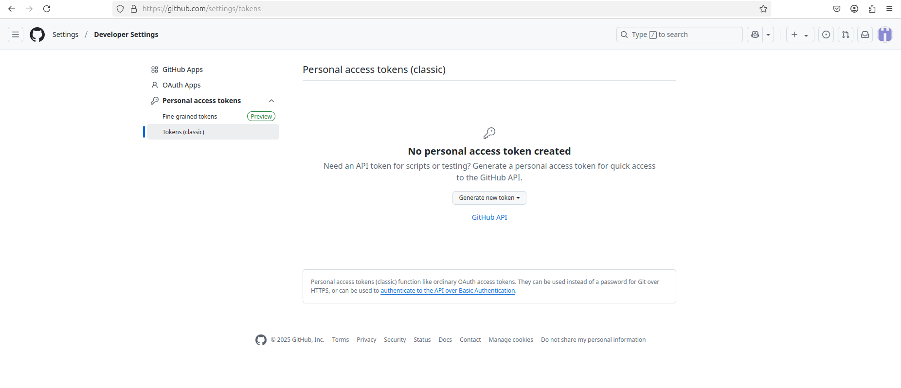

# Ubuntu Configuring & Generate access token GitHub

## Git config

>access to the most recent stable version of Git with this command

```bash
  sudo add-apt-repository ppa:git-core/ppa
```

>next

```bash
sudo apt-get update
```

>next

```bash
sudo apt-get install git
```

```bash
git config --global user.name "User Name"
```

```bash
git config --global user.email "user@email.com"
```

```bash
git config --global init.defaultBranch main
```

```bash
git config --global core.editor "code --wait"
```

```bash
echo "export GIT_MERGE_AUTOEDIT=no" >> ~/.zshrc
```

```bash
git config --global pull.rebase false
```

## Generate access token

>[Click here github generate access codes](https://github.com/settings/tokens)



>On the Personal access tokens (classic) page, click Generate new token and then Generate new token (classic)


>[!NOTE]
> 📌 ***Done :) end the session `and` go to next step***
