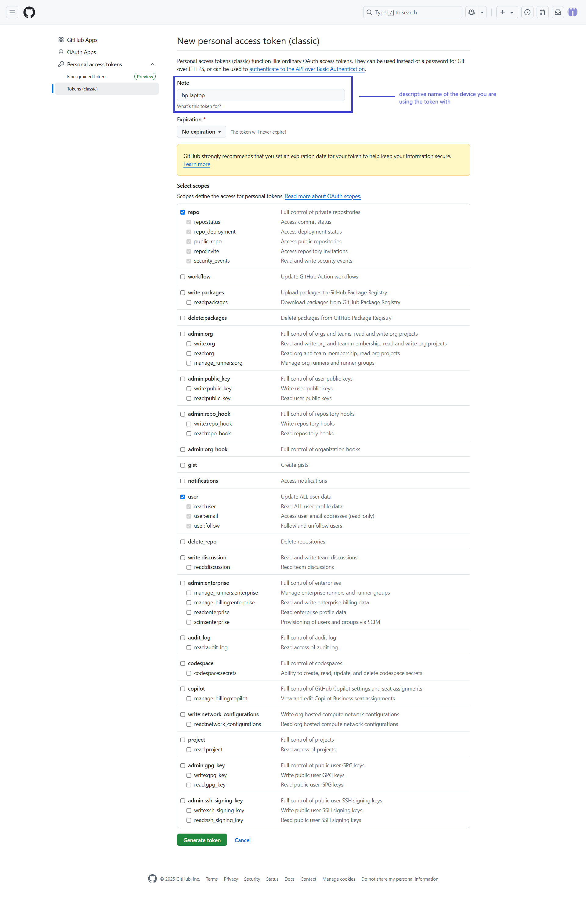
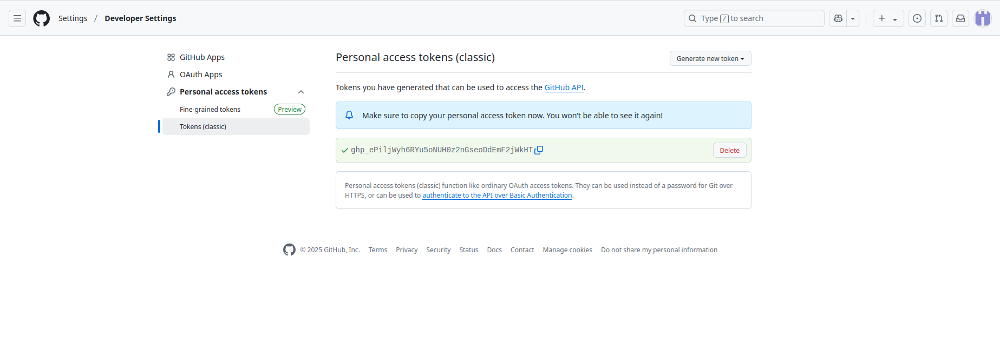

# Ubuntu Configuring & Generate access token GitHub

## Git config

>access to the most recent stable version of Git with this command

```bash
  sudo add-apt-repository ppa:git-core/ppa
```

>next

```bash
sudo apt-get update
```

>next

```bash
sudo apt-get install git
```

```bash
git config --global user.name "User Name"
```

```bash
git config --global user.email "user@email.com"
```

```bash
git config --global init.defaultBranch main
```

```bash
git config --global core.editor "code --wait"
```

```bash
echo "export GIT_MERGE_AUTOEDIT=no" >> ~/.zshrc
```

```bash
git config --global pull.rebase false
```

## Generate access token

>[Click here github generate access codes](https://github.com/settings/tokens)


>On the Personal access tokens (classic) page, click Generate new token and then Generate new token (classic)



>You will be taken back to the Personal access tokens page, and the token you just created will be visible:



Click the copy button to copy the newly created token.

You will only see the token on this page ONCE. You MUST copy it now and paste it in a secure and private place where you can easily access it later when you need it. Treat this token as you would a password! The token will be used in place of a password to interact with GitHub on the command line!

Using multiple machines? It is best practice to create a new token for each device requiring command-line access to GitHub. This way, if you need to revoke access to any single device, none of your other devices are impacted.

Place the token in a secure place! The next time you interact with GitHub on the command line, you will be asked to provide a username and password. Use this token in place of a password.

>[!NOTE]
> 📌 ***Done :) end the session `and` go to next step***
