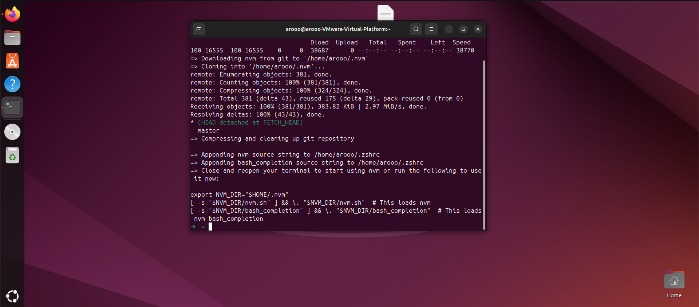

# Configuring JavaScript environment

>**1- install nvm**

```bash
curl -o- https://raw.githubusercontent.com/nvm-sh/nvm/v0.39.7/install.sh | bash
```

>ompleted installation of nvm



Restart the Terminal application now.

>After starting up the Terminal again, run this command to check the version of nvm

```bash
nvm --version 
```

>**2- install node.js**

syntax = nvm install `Enter the required release`

ask NVM which versions of Node are available

```bash
nvm list-remote
```

It’s a very long list. You can install a version of Node by writing in any of the release versions listed. For instance, to get version v20, then run

```bash
nvm install 
```
