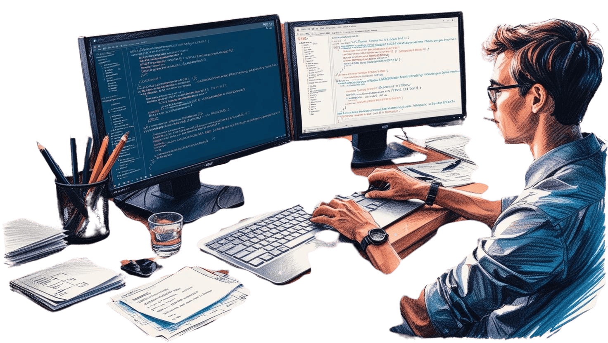

# 

## Resources

* [Resources](/Assets/things/Resources.md) Resources that help with programming
* [Command line](/Assets/things/most-used-command-line.md) Quick access to the most commonly used command line

## Preparing and configuring a workstation

* [Windows](./Windows)
* [Ubuntu](/Ubuntu/README.md)
* [Mac](./Mac)

## Fundamental tools

* [VScode](/Assets/things/vscode.md#table-of-contents)
* [Github](/Assets/things/github.md#table-of-contents)

## Preparing and configuring a programming language environment

* [Programming Language](/Programming-environment/README.md)
