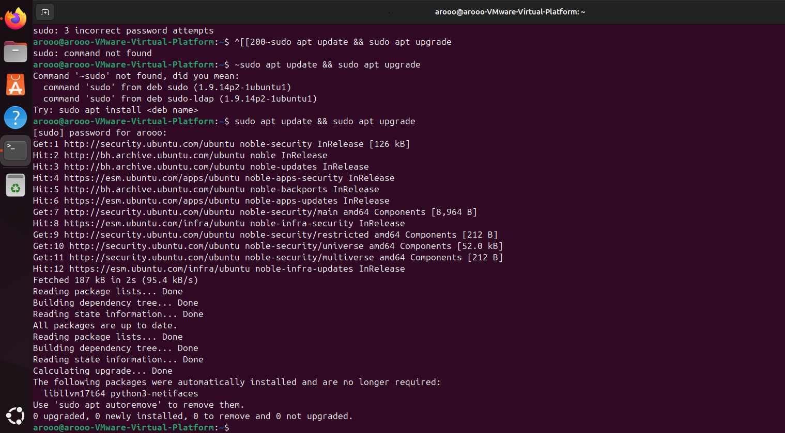
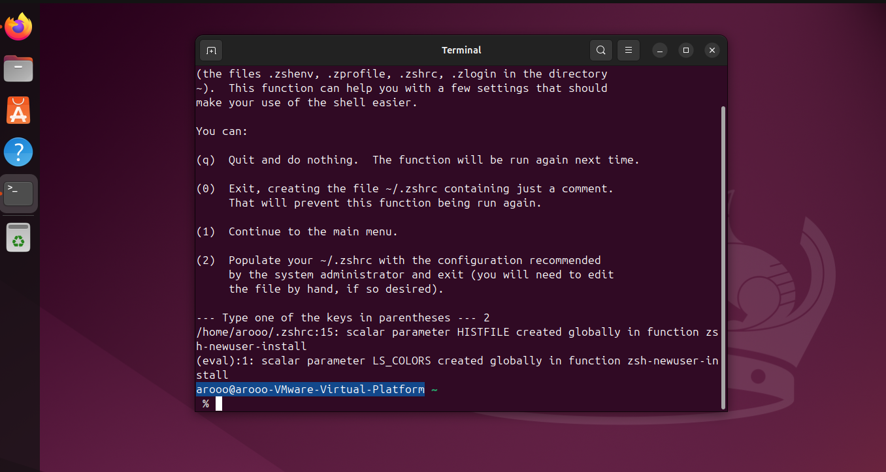
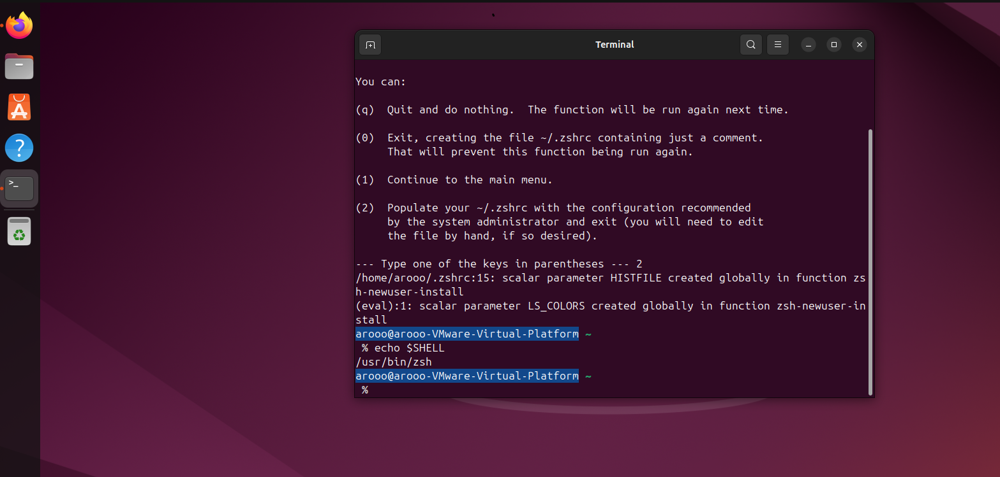
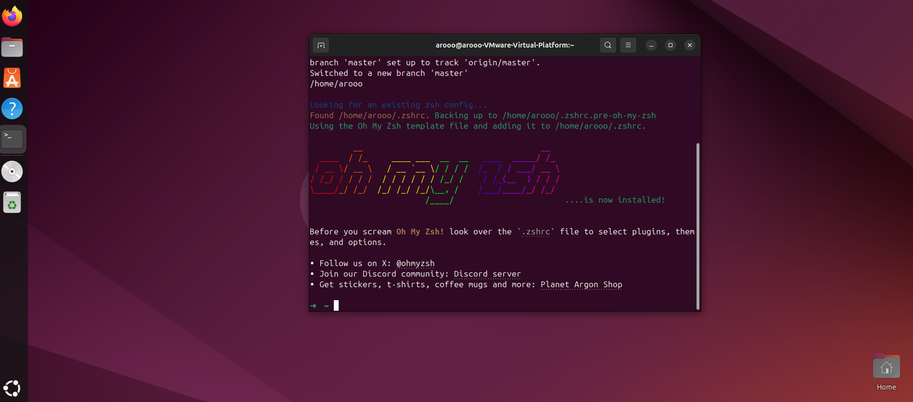

<h1 align="center">
  
  <br />
    Configuring a development environment Ubuntu
</h1>

1. [vscode](./README.md#vscode)
    * [install VSCode](../VSCode/Ubuntu-Configuring-VSCode.md)
    * [Configuring VSCode](../VSCode/Ubuntu-Configuring-VSCode.md)
    * [**optional** - Additional extensions](../VSCode/Ubuntu-Configuring-VSCode.md)

2. [updating ubuntu](./README.md#updating-ubuntu)

>**Updating and upgrading packages**

```bash
sudo apt update && sudo apt upgrade
```



>**curl**

Since you already have the terminal open, take the opportunity to install curl, which will let you install applications with just a URL, as you'll see us do soon. Use this command:

```bash
sudo apt install curl
```

>**Zsh**

Bash is Ubuntu's default shell (command interpreter), but Z shell is more commonly used in modern systems by default, so that's what we will use. Install it with this command, and accept the changes to be made by entering **`Y`** when prompted to continue:

```bash
sudo apt install zsh
```

Verify the installation with this command:

```bash
zsh --version
```

Make Zsh the default shell with this command:

```bash
chsh -s $(which zsh)
```

End your terminal session by closing the terminal window. Log out of your account, then log back in.

Open a new terminal window. As shown below, you should be prompted to run a configuration setup for new users:


Enter `2` to accept the default configuration.

Your terminal prompt should look a little different now!



Let's confirm it worked with this command:

```bash
echo $SHELL
```

This should print **`/usr/bin/zsh`**



3. [Configuring & Generate access token GitHub](../GitHub/Ubuntu-Configuring-GitHub.md)

4. [Configuring & Generate access token GitHub](../GitHub/Ubuntu-Configuring-GitHub.md)

>**Oh My Zsh**

```bash
sh -c "$(curl -fsSL https://raw.githubusercontent.com/ohmyzsh/ohmyzsh/master/tools/install.sh)"
```

>[!NOTE]
> 📌 ***Note that your prompt has now changed to simply be `~` This is the desired outcome***



> ***end the session `and` go to next step***

## step 5

[Configuring a .gitignore global file](../Assets/gitignore_global.md)

## step 6

[Setting up and preparing the programming language environment](../Programming-Language-Environment/README.md)

>[!NOTE]
> 📌 ***setup to start developing in ubuntu has done***
