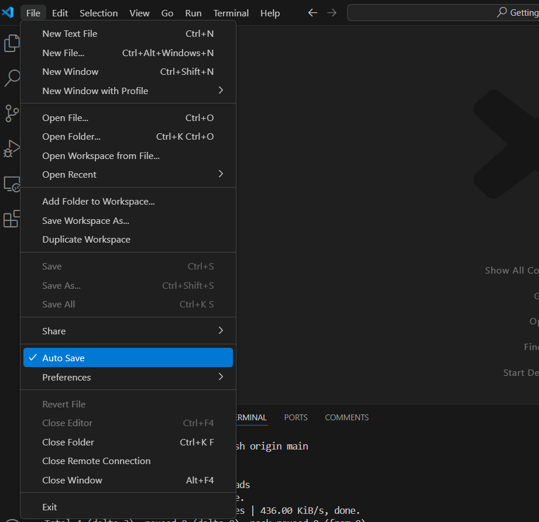

# Ubuntu configuring vscode

## Visual Studio Code

## step 3

- Download and install the `.deb` package for VS Code **[here](https://code.visualstudio.com/)**

>[if nedd, more help with instalation](https://code.visualstudio.com/docs/setup/linux)

- [Additional vsCode extensions](../VSCode/README.md)

>[!NOTE]
> 📌 ***turn on `Auto Save` setting is in the File menu***

***end the session py [return](../Ubuntu/README.md) for next step***
